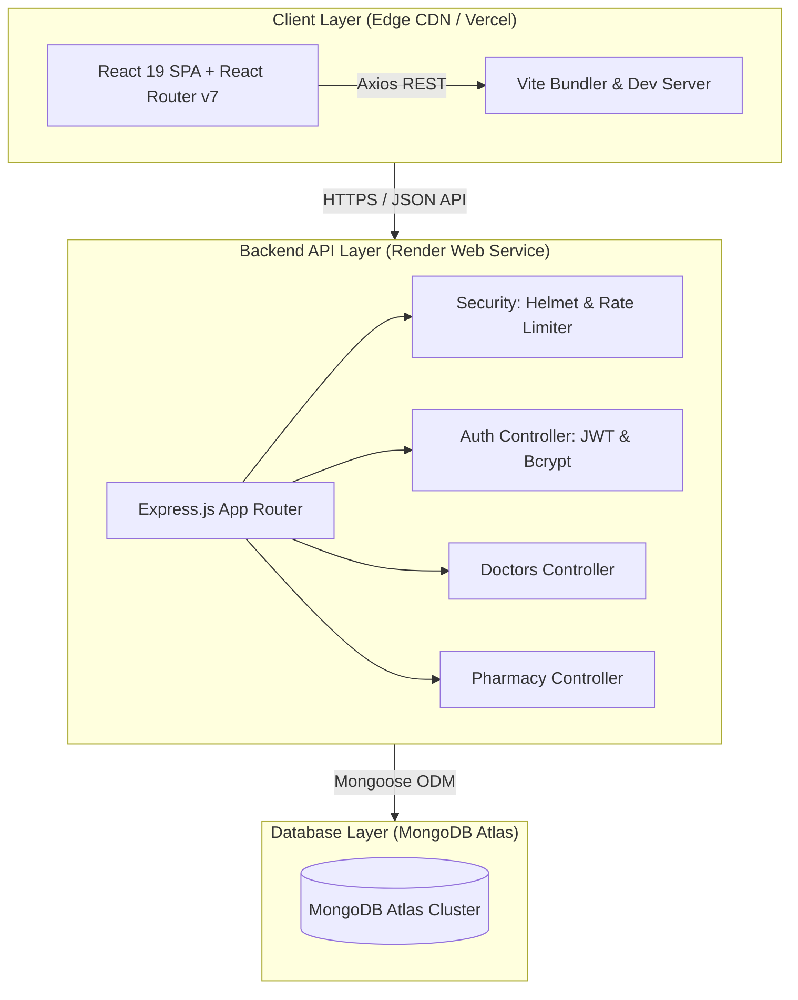

<div align="center">

# 🏥 NovaCare Hospital System
### *Enterprise Healthcare Management & Patient Portal Platform*

[](https://github.com/HasnatKhan010/NovaCare-Hospital-System)
[](https://github.com/HasnatKhan010/NovaCare-Hospital-System/actions/workflows/ci.yml)
[](https://nodejs.org/)
[](https://react.dev/)
[](https://vitejs.dev/)
[](https://tailwindcss.com/)
[](https://www.docker.com/)
[](LICENSE)

<br/>

[✨ Features](#-features) •
[🏗 Architecture](#-architecture) •
[🛠 Tech Stack](#-tech-stack) •
[🚀 Getting Started](#-getting-started) •
[🧪 Testing](#-testing-suite) •
[🌐 API Reference](#-api-reference) •
[☁️ Production Deployment](#-production-deployment)

</div>

---

## 📖 Executive Summary

**NovaCare Hospital System** is an enterprise-grade, full-stack healthcare web application and patient portal engineered to reflect real-world clinical institutions (e.g., Mayo Clinic, Cleveland Clinic, MyChart). 

The platform features an institutional hospital portal with real-time ER wait time tracking, department listings, doctor directories, a secure patient portal with JWT authentication, direct online doctor appointment booking, and a integrated hospital pharmacy store.

---

## ✨ Features

### 🛡️ Enterprise Patient Portal (`/portal/*`)
* **Secure Access**: JWT-based authentication for Patients, Staff, and Administrators with auto-logout token expiration handlers.
* **Integrated Booking**: Search doctors by specialty, view credentials, and book appointments directly inside the private patient dashboard.
* **Pharmacy Refills**: Browse medications, view dosage information, and order prescriptions directly from the hospital inventory.

### 🏥 Public Institutional Web Portal
* **Live Hospital Alerts**: Dynamic ticker for ER wait times, masking rules, and visitor guidelines.
* **Specialist Directory**: Comprehensive directory with experience indicators and department categorization.
* **Department Insights**: Cardiology, Neurology, Pediatrics, Orthopedics, and Emergency Care overviews.

### 🎨 Modern "Ocean & Medical" Design System
* Built with custom HSL palette tailored for trust and clean clinical aesthetics.
* Glassmorphism navigation (`backdrop-blur-xl`), smooth micro-animations, and custom typography (`Outfit` & `Inter`).
* Responsive design across all desktop, tablet, and mobile breakpoints.

---

## 🏗 System Architecture



---

## 🛠 Tech Stack

| Component | Technologies Used |
| :--- | :--- |
| **Frontend Framework** | React 19, React Router v7, Recharts |
| **Styling & Design** | Tailwind CSS v3, PostCSS, Lucide Icons, Google Fonts (Outfit & Inter) |
| **Build Tooling** | Vite v6 (ESM HMR Build Engine) |
| **Backend Runtime** | Node.js v18+, Express.js v5 |
| **Database & ORM** | MongoDB, Mongoose ODM |
| **Security & Auth** | JSON Web Tokens (JWT), Bcrypt, Helmet.js, Express-Rate-Limit |
| **Testing** | Node Native `--test` Runner, Supertest, Custom Mongoose Mocks |
| **Containerization** | Docker, Multi-Stage Nginx Builds, Docker Compose |

---

## 🚀 Getting Started

### Prerequisites
* **Node.js**: `v18.0.0` or higher
* **npm**: `v9.0.0` or higher
* **MongoDB**: Local MongoDB instance or MongoDB Atlas Connection URI

---

### 📦 Quickstart with Docker Compose (Recommended)

To spin up the entire unified microservice stack (Frontend Nginx + Backend Express + MongoDB) in a single command:

```bash
# Clone the repository
git clone https://github.com/HasnatKhan010/NovaCare-Hospital-System.git
cd NovaCare-Hospital-System

# Spin up all containers
docker-compose up -d --build
```
- **Frontend Portal**: `http://localhost`
- **Backend API**: `http://localhost:5000`

---

### 🔧 Manual Setup for Local Development

#### 1️⃣ Backend Setup
```bash
cd novacare_backend

# Install dependencies
npm install

# Environment Variables (.env)
PORT=5000
MONGO_URI=mongodb://127.0.0.1:27017/medilink
JWT_SECRET=your_super_secret_jwt_key
JWT_REFRESH_SECRET=your_super_secret_refresh_key

# Start Development Server
npm run dev
```

#### 2️⃣ Frontend Setup
```bash
cd novacare_frontend

# Install dependencies
npm install

# Environment Variables (.env)
VITE_API_URL=http://localhost:5000

# Start Frontend Vite Server
npm start
```

---

## 🧪 Testing Suite

NovaCare includes an automated, zero-dependency integration test suite built with Node.js native test runner (`node --test`) and `Supertest`. 

To bypass local C++ Redistributable requirements on Windows, the test suite leverages **Native Mongoose Cursor Mocking** to execute in under **1.2 seconds**.

```bash
cd novacare_backend
npm test
```

#### Test Coverage Summary:
- `✔` **Health Checks**: GET `/api/health` & Base Route `/`
- `✔` **User Auth**: Signup creation (`200 OK`) and Duplicate email rejection (`409 Conflict`)
- `✔` **Doctor Directory**: Mocked pagination & dataset streaming (`GET /api/doctors`)

---

## 🌐 API Reference

| Method | Endpoint | Description | Auth Required |
| :--- | :--- | :--- | :---: |
| `GET` | `/api/health` | System heartbeat & server uptime | ❌ |
| `POST` | `/api/auth/signup` | Register new patient account | ❌ |
| `POST` | `/api/auth/login` | Authenticate user & receive JWT | ❌ |
| `GET` | `/api/doctors` | Retrieve doctor directory with pagination | ❌ |
| `POST` | `/api/doctors` | Register new doctor (Admin) | 🔒 Admin |
| `GET` | `/api/medicines` | Retrieve pharmacy catalog | 🔒 Patient |
| `POST` | `/api/appointments` | Book specialist appointment | 🔒 Patient |

---

## ☁️ Production Deployment

The project is pre-configured for **100% Free** cloud deployment using Infrastructure-as-Code.

### Deployment Stack
1. **Frontend**: Host on **Vercel** (`novacare_frontend`). The included `vercel.json` automatically manages SPA rewrites for React Router.
2. **Backend**: Host on **Render** (`novacare_backend`). The included `render.yaml` Blueprint provisions the Node.js Web Service automatically.
3. **Database**: Host on **MongoDB Atlas** (Free M0 Cluster).

---

<div align="center">
  <sub>Designed & Developed for Modern Institutional Healthcare</sub><br/>
  <b>NovaCare Hospital System &copy; 2026</b>
</div>
